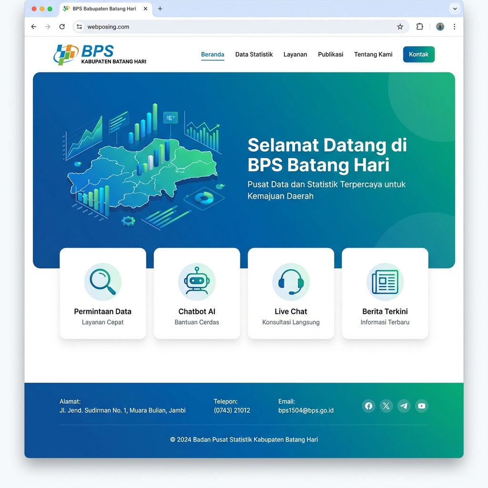
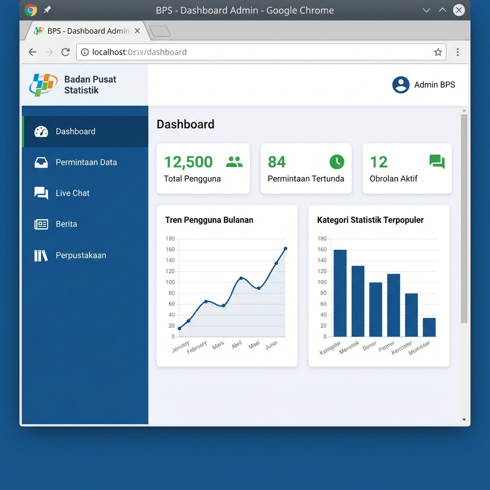

# 📊 Sistem Informasi BPS Batang Hari

<div align="center">


**Platform Layanan Publik & Analisis Data Statistik BPS Kabupaten Batang Hari**

[Fitur](#-fitur-utama) • [Instalasi](#️-instalasi) • [Penggunaan](#-penggunaan) • [Dokumentasi](#-dokumentasi)

</div>

---

## 📖 Tentang Proyek

Sistem Informasi BPS Batang Hari adalah platform web terintegrasi yang dirancang untuk:
- 🏢 **Layanan Publik**: Memfasilitasi permohonan data statistik dari OPD (Organisasi Perangkat Daerah)
- 📈 **Analisis Data**: Menganalisis dataset Susenas (Survei Sosial Ekonomi Nasional) dengan visualisasi interaktif
- 🤖 **AI Chatbot**: Asisten virtual cerdas untuk menjawab pertanyaan seputar data BPS
- 💬 **Live Chat**: Komunikasi real-time antara pengguna dan petugas BPS
- 📰 **Manajemen Konten**: Publikasi berita, pustaka, dan informasi statistik

---

## 📸 Screenshots

<div align="center">

### 🏠 Landing Page


### 📊 Admin Dashboard


</div>

---

## ✨ Fitur Utama

### 🔐 Multi-Role Authentication
- **Admin**: Akses penuh ke seluruh sistem
- **Petugas BPS (Operator)**: Mengelola permohonan data, live chat, dan konten
- **Pengguna OPD**: Mengajukan permohonan data dan mengakses layanan publik

### 📊 Dashboard Analisis Data Susenas
- Upload dan parsing file SPSS (.sav)
- Ekstraksi metadata variabel dan konteks dari PDF
- Analisis statistik deskriptif (frekuensi, crosstab, mean, median)
- Visualisasi data interaktif dengan Chart.js
- Export hasil analisis ke PDF
- Pencarian KBLI (Klasifikasi Baku Lapangan Usaha Indonesia)

### 🤖 AI Chatbot Terintegrasi
- Powered by Google Gemini API
- Pengetahuan mendalam tentang data BPS Batang Hari
- Integrasi dengan BPS Web API untuk data real-time
- Sistem feedback untuk peningkatan kualitas
- Konteks percakapan yang persisten

### 💬 Live Chat Real-time
- Broadcasting dengan Laravel Reverb (WebSocket)
- Notifikasi instant untuk pesan baru
- Panel moderasi untuk petugas BPS
- Riwayat percakapan tersimpan

### 📝 Sistem Permohonan Data
- Form permohonan online dengan upload surat resmi
- Tracking status permohonan
- Notifikasi email otomatis
- Manajemen persetujuan oleh petugas BPS

### 📰 Manajemen Konten
- CRUD berita dengan rich text editor
- Upload dan manajemen dokumen pustaka
- Galeri foto dan media
- Publikasi informasi sektoral

---

## 🛠️ Tech Stack

| Kategori | Teknologi |
|----------|-----------|
| **Backend** | PHP 8.2+, Laravel 12 |
| **Admin Panel** | Filament v4 |
| **Frontend** | Blade, Livewire, Alpine.js, Tailwind CSS 4 |
| **Real-time** | Laravel Reverb, Pusher JS, Laravel Echo |
| **Database** | MySQL |
| **AI/ML** | Google Gemini API |
| **Visualisasi** | Chart.js, ECharts |
| **PDF Processing** | Smalot PDF Parser, Spatie PDF to Image |
| **Security** | Laravel Sanctum, Filament Shield |

---

## ⚙️ Instalasi

### Prasyarat
Pastikan sistem Anda memiliki:
- PHP >= 8.2
- Composer
- Node.js >= 18.x & NPM
- MySQL >= 8.0
- Git

### Langkah Instalasi

#### 1️⃣ Clone Repository
```bash
git clone https://github.com/sNyum/blogify-main.git
cd blogify-main
```

#### 2️⃣ Install Dependencies
```bash
# Install PHP dependencies
composer install

# Install JavaScript dependencies
npm install
```

#### 3️⃣ Konfigurasi Environment
```bash
# Salin file environment
cp .env.example .env

# Generate application key
php artisan key:generate
```

#### 4️⃣ Konfigurasi Database
Edit file `.env` dan sesuaikan konfigurasi database:
```env
DB_CONNECTION=mysql
DB_HOST=127.0.0.1
DB_PORT=3306
DB_DATABASE=nama_database
DB_USERNAME=username
DB_PASSWORD=password
```

#### 5️⃣ Konfigurasi API Keys
Tambahkan API keys di file `.env`:
```env
# Google Gemini AI
GEMINI_API_KEY=your_gemini_api_key

# BPS Web API
BPS_API_KEY=your_bps_api_key
BPS_DOMAIN_ID=5207  # Kode domain Batang Hari
```

#### 6️⃣ Migrasi Database & Seeding
```bash
# Jalankan migrasi
php artisan migrate

# Seed data awal (admin, user contoh)
php artisan db:seed
```

**Default Login Credentials:**
- **Admin**: `admin@bps.go.id` / `password`
- **Petugas BPS**: `staff@bps.go.id` / `password`
- **User OPD**: `user@opd.go.id` / `password`

> ⚠️ **Penting**: Segera ubah password default setelah login pertama!

#### 7️⃣ Setup Storage
```bash
# Link storage untuk upload file
php artisan storage:link
```

#### 8️⃣ Compile Assets
```bash
# Development
npm run dev

# Production
npm run build
```

#### 9️⃣ Jalankan Aplikasi
Buka **3 terminal** terpisah dan jalankan:

**Terminal 1 - Laravel Server:**
```bash
php artisan serve
```

**Terminal 2 - Queue Worker (untuk email & jobs):**
```bash
php artisan queue:work
```

**Terminal 3 - Reverb (WebSocket untuk live chat):**
```bash
php artisan reverb:start
```

**Terminal 4 - Vite Dev Server (jika development):**
```bash
npm run dev
```

#### 🎉 Akses Aplikasi
- **Frontend**: http://localhost:8000
- **Admin Panel**: http://localhost:8000/admin

---

## 🚀 Penggunaan

### Untuk Pengguna OPD

1. **Registrasi Akun**
   - Klik "Daftar" di halaman utama
   - Isi data organisasi dan kontak
   - Verifikasi email

2. **Mengajukan Permohonan Data**
   - Login ke dashboard
   - Pilih menu "Permohonan Data"
   - Upload surat permohonan resmi (PDF)
   - Isi detail data yang dibutuhkan
   - Submit dan tunggu persetujuan

3. **Menggunakan AI Chatbot**
   - Klik ikon chat di pojok kanan bawah
   - Tanyakan informasi statistik Batang Hari
   - Contoh: "Berapa jumlah penduduk Batang Hari tahun 2024?"

4. **Live Chat dengan Petugas**
   - Akses menu "Konsultasi"
   - Kirim pesan ke petugas BPS
   - Dapatkan respons real-time

### Untuk Petugas BPS

1. **Mengelola Permohonan**
   - Login ke admin panel
   - Buka "Permohonan Data"
   - Review dan approve/reject permohonan
   - Download surat permohonan

2. **Moderasi Live Chat**
   - Buka "Live Chat"
   - Lihat daftar percakapan aktif
   - Balas pesan pengguna
   - Tandai percakapan selesai

3. **Analisis Data Susenas**
   - Upload file .sav di menu "Susenas Dashboard"
   - Upload PDF konteks variabel (opsional)
   - Pilih variabel untuk analisis
   - Generate visualisasi dan export PDF

4. **Manajemen Konten**
   - Publikasi berita di menu "Berita"
   - Upload dokumen di "Pustaka"
   - Update informasi sektoral

---

## 📂 Struktur Proyek

```
blogify-main/
├── app/
│   ├── Filament/          # Admin panel resources & pages
│   ├── Http/
│   │   └── Controllers/   # Controllers untuk frontend
│   ├── Models/            # Eloquent models
│   ├── Services/          # Business logic services
│   │   ├── AiChatbotService.php
│   │   ├── BpsApiService.php
│   │   ├── KBLISearchService.php
│   │   └── SusenasDashboardService.php
│   ├── Events/            # Broadcasting events
│   └── Policies/          # Authorization policies
├── config/
│   ├── bps_*.php          # Konfigurasi data BPS
│   └── filament.php       # Konfigurasi Filament
├── database/
│   ├── migrations/        # Database migrations
│   └── seeders/           # Data seeders
├── resources/
│   ├── views/             # Blade templates
│   │   ├── layouts/       # Layout templates
│   │   ├── livewire/      # Livewire components
│   │   └── pages/         # Page views
│   └── js/                # JavaScript files
├── routes/
│   ├── web.php            # Web routes
│   ├── channels.php       # Broadcasting channels
│   └── api.php            # API routes
└── public/
    └── storage/           # Public storage (linked)
```

---

## 🔧 Konfigurasi Lanjutan

### Email Configuration
Edit `.env` untuk konfigurasi email:
```env
MAIL_MAILER=smtp
MAIL_HOST=smtp.gmail.com
MAIL_PORT=587
MAIL_USERNAME=your-email@gmail.com
MAIL_PASSWORD=your-app-password
MAIL_ENCRYPTION=tls
MAIL_FROM_ADDRESS=noreply@bps-batanghari.go.id
MAIL_FROM_NAME="BPS Batang Hari"
```

### Broadcasting Configuration
Untuk production, sesuaikan konfigurasi Reverb:
```env
REVERB_APP_ID=your-app-id
REVERB_APP_KEY=your-app-key
REVERB_APP_SECRET=your-app-secret
REVERB_HOST=your-domain.com
REVERB_PORT=8080
REVERB_SCHEME=https
```

### File Upload Limits
Edit `php.ini` untuk meningkatkan limit upload:
```ini
upload_max_filesize = 50M
post_max_size = 50M
max_execution_time = 300
```

---

## 🧪 Testing

```bash
# Jalankan semua tests
php artisan test

# Test spesifik
php artisan test --filter=ChatbotTest

# Dengan coverage
php artisan test --coverage
```

---

## 📚 Dokumentasi

### API Endpoints

#### AI Chatbot
```http
POST /api/chatbot/message
Content-Type: application/json

{
  "message": "Berapa jumlah penduduk Batang Hari?",
  "session_id": "optional-session-id"
}
```

#### BPS Web API Integration
```php
// Mencari data di BPS API
$service = app(BpsApiService::class);
$results = $service->searchContent('inflasi');
```

### Broadcasting Events

#### Chat Message Event
```php
use App\Events\MessageSent;

broadcast(new MessageSent($message))->toOthers();
```

---

## 🤝 Kontribusi

Kontribusi sangat diterima! Silakan:

1. Fork repository ini
2. Buat branch fitur (`git checkout -b feature/AmazingFeature`)
3. Commit perubahan (`git commit -m 'Add some AmazingFeature'`)
4. Push ke branch (`git push origin feature/AmazingFeature`)
5. Buat Pull Request

---

## 🐛 Troubleshooting

### Masalah Umum

**1. Error "Class not found"**
```bash
composer dump-autoload
php artisan optimize:clear
```

**2. Live chat tidak berfungsi**
```bash
# Pastikan Reverb berjalan
php artisan reverb:start

# Cek konfigurasi broadcasting
php artisan config:clear
```

**3. Upload file gagal**
```bash
# Pastikan storage linked
php artisan storage:link

# Cek permission folder
chmod -R 775 storage bootstrap/cache
```

**4. Migrasi error**
```bash
# Reset database (HATI-HATI: menghapus semua data)
php artisan migrate:fresh --seed
```

---

## 📄 Lisensi

Proyek ini dilisensikan di bawah [MIT License](LICENSE).

---

## 👥 Tim Pengembang

Dikembangkan oleh Tim IT BPS Kabupaten Batang Hari

---

## 📞 Kontak & Dukungan

- **Website**: https://batangharikab.bps.go.id
- **Email**: bps5207@bps.go.id
- **Telepon**: (0741) 12345

---

<div align="center">

**⭐ Jika proyek ini bermanfaat, berikan star di GitHub! ⭐**

Made with ❤️ by BPS Batang Hari

</div>
